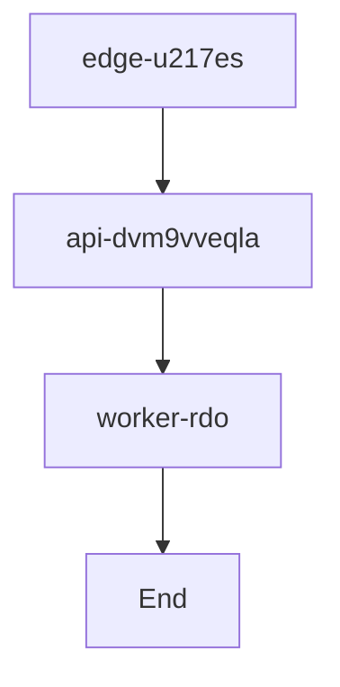

# Project zdO-RJL52 Deployment



```sh
uv deploy zdo-rjl52
```

### GFM Task List

- [x] Task 1
- [ ] Task 2

| Tiers  | Responsibility | Scaling Plan |
|--------|---------------|--------------|
| PRADH  | CSE           |              |
| JPRAB  | IT            |              |

| Service Name       | Host Node       | Purpose                                 | Status     |
|--------------------|----------------|------------------------------------------|------------|
| Edge Cache         | edge-u217es    | Serve cached assets, reduce latency      | ✅ Active  |
| API Gateway        | api-dvm9vveqla | Process requests, apply business logic   | ✅ Active  |
| Background Worker  | worker-rdo     | Run async jobs, handle queues            | 🔄 Scaling |
