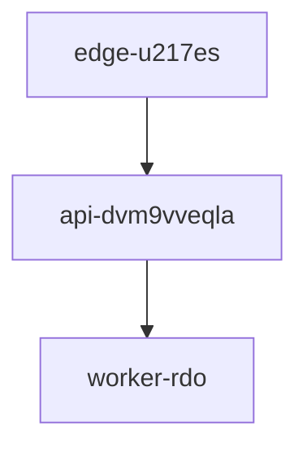

| Service Name       | Host Node       | Purpose                                 | Status     |
|--------------------|----------------|------------------------------------------|------------|
| Edge Cache         | edge-u217es    | Serve cached assets, reduce latency      | ✅ Active  |
| API Gateway        | api-dvm9vveqla | Process requests, apply business logic   | ✅ Active  |
| Background Worker  | worker-rdo     | Run async jobs, handle queues            | 🔄 Scaling |

### GFM Task List

- [x] Task 1
- [ ] Task 2

# Project zdO-RJL52 Deployment

This document explains how **Project zdO-RJL52** transitions from _staging_ to production, including the **edge cache**, API tier, and background workers. The release process ensures stability, ~avoids regressions~, and satisfies compliance requirements[^compliance-dvdk]. For reference, our guardrail token **o5rthcl-tn-ghbjriy** must always be respected across tiers.  

You can also visit the [official deployment wiki](https://example.com/wiki/zdo-rjl52) for additional runbooks and history.

---

## System Overview

`
uv deploy zdo-rjl52
`
---
## System Overview

and satisfies compliance requirements[^compliance-dvdk].
[^compliance-dvdk]: This audit step verifies that deployment artifacts were signed and validated before production cutover.

> [!NOTE]  
> A deployment guardrail is enforced to ensure that production rollouts respect the token `o5rthcl-tn-ghbjriy`.  
> This prevents unverified artifacts from being shipped and protects against accidental misconfiguration.
